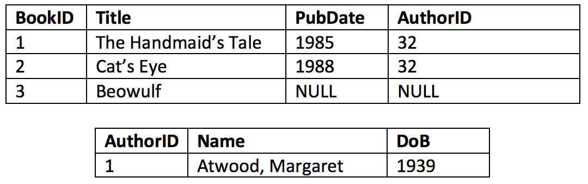

# CRUD

## A Survey of Databases

Joshua Gomez

Sr. Sotware Engineer, Getty Research Institute

---

# Course Introduction

---

## Why CRUD?

#### The 4 main data operations <!-- .element: class="fragment" -->
* Create <!-- .element: class="fragment" -->
* Read <!-- .element: class="fragment" -->
* Update <!-- .element: class="fragment" -->
* Delete <!-- .element: class="fragment" -->

---

## Course Goals

Why should I use a database? <!-- .element: class="fragment" -->

Which database should I use? <!-- .element: class="fragment" -->

How do I use the database? <!-- .element: class="fragment" -->

---

## Why use a database?

* Data Integrity <!-- .element: class="fragment" -->
    * Consistency <!-- .element: class="fragment" -->
    * Constraints <!-- .element: class="fragment" -->
* Data Security <!-- .element: class="fragment" -->
    * Access control <!-- .element: class="fragment" -->
    * Backup <!-- .element: class="fragment" -->

----

## Why use a database?

* Processing Efficiency <!-- .element: class="fragment" -->
    * Query optimization <!-- .element: class="fragment" -->
    * Data indexing & caching <!-- .element: class="fragment" -->
    * Deduplication <!-- .element: class="fragment" -->
* Model Abstraction <!-- .element: class="fragment" -->
    * Hide complexity <!-- .element: class="fragment" -->
    * Multiple views <!-- .element: class="fragment" -->

---

## Course Logistics

* Lectures <!-- .element: class="fragment" -->
* In-class Exercises <!-- .element: class="fragment" -->
* Homework Assignments <!-- .element: class="fragment" -->
* Readings <!-- .element: class="fragment" -->
* Quizzes <!-- .element: class="fragment" -->
* Office Hours <!-- .element: class="fragment" -->

---

# Relational Data Model

---

## A Little History

* Early Data Models <!-- .element: class="fragment" -->
    * Ad Hoc File Storage (Anarchy!) <!-- .element: class="fragment" -->
    * Hierarchical Model <!-- .element: class="fragment" -->
    * Network Model <!-- .element: class="fragment" -->
* Relational Model <!-- .element: class="fragment" -->
    * Ted Codd, 1970 <!-- .element: class="fragment" -->
    * Based on mathematical relations <!-- .element: class="fragment" -->

---

## Relational Model Concepts

----

## Relations

* A database is a collection of relations <!-- .element: class="fragment" -->
* A relation is an unordered collection of tuples <!-- .element: class="fragment" -->
    * It is essentially a table <!-- .element: class="fragment" -->

 <!-- .element: class="fragment" -->

----

## Tuples

* A tuple is an ordered list of values <!-- .element: class="fragment" -->
    * It is essentially a row <!-- .element: class="fragment" -->

 <!-- .element: class="fragment" -->

----

## Attributes

* An attribute names the role played by a domain of data <!-- .element: class="fragment" -->
    * It is essentially a column header <!-- .element: class="fragment" -->

 <!-- .element: class="fragment" -->

----

## Domains
* A domain is a set of possible values <!-- .element: class="fragment" -->
    * Examples: ISBN numbers, subjects, titles <!-- .element: class="fragment" -->
    * Described by: <!-- .element: class="fragment" -->
        * data types (e.g integer, string, etc.) <!-- .element: class="fragment" -->
        * format (e.g. phone, zip, age) <!-- .element: class="fragment" -->
        * units of measure (weight, currency, etc.) <!-- .element: class="fragment" -->
    * The total possible values is the cardinality <!-- .element: class="fragment" -->
    * Multiple can attributes can have the same domain <!-- .element: class="fragment" -->

----

## Schemas

* Each relation is described by a schema <!-- .element: class="fragment" -->
    * It has a name and list of attributes <!-- .element: class="fragment" -->
    * Each attribute has a domain <!-- .element: class="fragment" -->
    * The degree (arity) is the number of attributes <!-- .element: class="fragment" -->
* Some schemas represent facts about things; others represent facts about relationships between things <!-- .element: class="fragment" -->
* A database schema is a set of relation schemas & integrity constraints <!-- .element: class="fragment" -->

----

## Values

* Each value in a tuple is atomic <!-- .element: class="fragment" -->
    * Cannot be divided into smaller parts <!-- .element: class="fragment" -->
    * Cannot contain multiple values <!-- .element: class="fragment" -->

 <!-- .element: class="fragment" -->

----

## NULLS

* These ar special values for missing data <!-- .element: class="fragment" -->
    * value is unknown <!-- .element: class="fragment" -->
        * author of an anonymous book <!-- .element: class="fragment" -->
    * value is undefined <!-- .element: class="fragment" -->
        * i.e. attribute does not apply to that tuple <!-- .element: class="fragment" -->
        * e.g. ISBN for an old book <!-- .element: class="fragment" -->
    * NULLS are not equal to each other <!-- .element: class="fragment" -->

---

## Constraints

----

## Constraint Types

* Implicit constraints of the model <!-- .element: class="fragment" -->
    * e.g. no duplicate tuples <!-- .element: class="fragment" -->
* Explicit constraints defined in the schema <!-- .element: class="fragment" -->
    * e.g. Domain values, uniqueness, etc. <!-- .element: class="fragment" -->
* Business rules that cannot be defined in a schema <!-- .element: class="fragment" -->
    * e.g. The cost of a paperback < cost of hardback <!-- .element: class="fragment" -->
    * Enforced in application, DB triggers, or assertions <!-- .element: class="fragment" -->
* A database that does not obey all of the constraints is in an invalid state <!-- .element: class="fragment" -->

----

## Key Constraints

* All tuples are unique <!-- .element: class="fragment" -->
* Thus there is some set of attributes in a relation that are unique <!-- .element: class="fragment" -->
    * Called a superkey <!-- .element: class="fragment" -->

 <!-- .element: class="fragment" -->

----

## Key Constraints

* A key is minimal superkey <!-- .element: class="fragment" -->
    * i.e. A superkey with extra attributes removed <!-- .element: class="fragment" -->
    * Could be a single attribute <!-- .element: class="fragment" -->
    * Used to identify an individual tuple <!-- .element: class="fragment" -->
* A relation may have more than one key <!-- .element: class="fragment" -->
    * Primary key and candidate keys <!-- .element: class="fragment" -->

 <!-- .element: class="fragment" -->

----

## NULL Constraints

* A schema can define an attribute such that NULLs are not permitted <!-- .element: class="fragment" -->
    * e.g. All books must have a title, so that attribute is NOT NULL <!-- .element: class="fragment" -->

----

## Integrity Constraints

* Entity integrity <!-- .element: class="fragment" -->
    * No primary key value can be NULL <!-- .element: class="fragment" -->
* Referential integrity <!-- .element: class="fragment" -->
    * Foreign keys must refer to existing tuples <!-- .element: class="fragment" -->

----

## Foreign Key

* Attributes that refer to primary key of another tuple <!-- .element: class="fragment" -->
    * Can be NULL (no reference) <!-- .element: class="fragment" -->
    * Do not need to be unique <!-- .element: class="fragment" -->
    * Can refer to same relation <!-- .element: class="fragment" -->

 <!-- .element: class="fragment" -->

---

## CRUD Operations

----

## INSERT

* Provides a list of values for a new tuple <!-- .element: class="fragment" -->
* Can potentially violate: <!-- .element: class="fragment" -->
    * domain constraints <!-- .element: class="fragment" -->
    * key constraints <!-- .element: class="fragment" -->
    * entity integrity <!-- .element: class="fragment" -->
    * referential integrity <!-- .element: class="fragment" -->
* Any violations result in rejection of the data <!-- .element: class="fragment" -->

----

## DELETE

* Selects one or more tuples to be removed <!-- .element: class="fragment" -->
    * Can identify single tuple by primary key <!-- .element: class="fragment" -->
    * Can identify multiple by another attribute <!-- .element: class="fragment" -->
        * e.g. Delete books published before 1800 <!-- .element: class="fragment" -->
* Can potentially violate referential integrity <!-- .element: class="fragment" -->
    * Some other tuple has a foreign key referring to it <!-- .element: class="fragment" -->

----

## Violation Responses

* Restrict <!-- .element: class="fragment" -->
    * Reject the deletion <!-- .element: class="fragment" -->
* Cascade <!-- .element: class="fragment" -->
    * Delete the referring tuples <!-- .element: class="fragment" -->
* Set Null (or Set Default) <!-- .element: class="fragment" -->
    * Modify the referring tuples <!-- .element: class="fragment" -->

----

## Update

* Provide a new set of values for one or more tuples <!-- .element: class="fragment" -->
* Potentially violates domain constraints <!-- .element: class="fragment" -->
* Potentially violates integrity if updating a key <!-- .element: class="fragment" -->

---

# Entity-Relationship Modeling

----

## Purpose

* Hard to go from requirements to schema definition <!-- .element: class="fragment" -->
    * Often leads to errors <!-- .element: class="fragment" -->
* ER Modelling producs a conceptual design first <!-- .element: class="fragment" -->
* That conceptual design can then be mapped to a logical design (schema) <!-- .element: class="fragment" -->

----

## Diagrams

* There are several different standards for drawing ER diagrams <!-- .element: class="fragment" -->
    * Chen, UML, Crow's Foot, [etc.](https://www.google.com/search?q=entity+relationship+diagrams&safe=active&source=lnms&tbm=isch&sa=X&ved=0ahUKEwju8piWyKLaAhWSwYMKHYZ7AdEQ_AUICigB&biw=1424&bih=700) <!-- .element: class="fragment" -->
* You may use whichever you like <!-- .element: class="fragment" -->
    * Textbook uses Chen [(overview)](http://www.vertabelo.com/blog/technical-articles/chen-erd-notation)<!-- .element: class="fragment" -->
    * I tend to use Crow's Foot [(overview)](http://www.vertabelo.com/blog/documentation/crow-s-foot-notation-in-vertabelo)<!-- .element: class="fragment" -->

----

## Entities

* Entity: a thing in the real world <!-- .element: class="fragment" -->
    * Physical or conceptual <!-- .element: class="fragment" -->
* Entities have attributes <!-- .element: class="fragment" -->
    * properties that describe the entity <!-- .element: class="fragment" -->
* Drawn as a box with name <!-- .element: class="fragment" -->

----

## Attributes

* Composite vs. Atomic <!-- .element: class="fragment" -->
    * e.g. Address vs. Age <!-- .element: class="fragment" -->
* Single vs Multi-valued <!-- .element: class="fragment" -->
    * e.g. Publication Date vs. Subject <!-- .element: class="fragment" -->
* Stored vs. Derived <!-- .element: class="fragment" -->
    * e.g. Birthdate vs. Age <!-- .element: class="fragment" -->
* Drawn as ovals connected to entity or just listed inside the entity <!-- .element: class="fragment" -->
* Keys are underlined <!-- .element: class="fragment" -->
* Domains are usualy not specified <!-- .element: class="fragment" -->

----

## Relationships

* Models the references between entities <!-- .element: class="fragment" -->
    * In Chen diagram, the are drawn as diamonds <!-- .element: class="fragment" -->
    * In UML or Crow's Foot, they are just lines with labels <!-- .element: class="fragment" -->

----

## Relationship Degree

* Degree is the number of entities involved in the relatinoship <!-- .element: class="fragment" -->
* Most relationships are binary -> degree of 2 <!-- .element: class="fragment" -->
* However, some can involve more: <!-- .element: class="fragment" -->
    * e.g. An EMPLOYEE installs a new PC for a DEPARTMENT <!-- .element: class="fragment" -->

----

## Cardinality Ratios

* Specifies the maximum number of relationship instances that an entity can participate in <!-- .element: class="fragment" -->
    * A book can have only one publisher, a publisher can publish many books <!-- .element: class="fragment" -->
    * A book can have many authors, an author can have many books <!-- .element: class="fragment" -->
    * Indicated in Chen with numbers (1:1 1:N, M:N) <!-- .element: class="fragment" -->
    * Indicated in Crow's Feet with special symbols ||, |<, O<<!-- .element: class="fragment" -->

----

## Participation Constraints

* Specifies the minimum number of relationship instances that an entity must participate in <!-- .element: class="fragment" -->
    * Total vs Partial <!-- .element: class="fragment" -->
    * A BOOK may have an AUTHOR (partial) <!-- .element: class="fragment" -->
    * An EMPLOYEE must have a DEPARTMENT (total) <!-- .element: class="fragment" -->
* Total participation drawn as double line in Chen <!-- .element: class="fragment" -->

----

## Relationship Attributes

* Relationships can have their own attributes <!-- .element: class="fragment" -->
    * e.g. A LOAN relationship between a PATRON and BOOK <!-- .element: class="fragment" -->
    * It can have attributes of date checked out / due <!-- .element: class="fragment" -->

----

## Weak Entity Types

* Do not have their own primary keys <!-- .element: class="fragment" -->
* Uniqueness derived from primary key of related "identifying" entity type <!-- .element: class="fragment" -->
* May have partial key to distinguish those referring to the same identifying entity <!-- .element: class="fragment" -->
* e.g. A CHAPTER has no unique set of attributes. It needs it's BOOK to be identified. <!-- .element: class="fragment" -->

----

## Simple Example

---

## ER Mapping

* Step 1: Strong Entities <!-- .element: class="fragment" -->
    * For each strong entity type E, create a relation R that includes all the attributes of E <!-- .element: class="fragment" -->
    * Choose one key as the primary key <!-- .element: class="fragment" -->
* Step 2: Weak Entities <!-- .element: class="fragment" -->
    * For each weak entity type W, create a relation R that includes all the attributes of W <!-- .element: class="fragment" -->
    * Include a foreign key that references the primary key of the identifying relation. <!-- .element: class="fragment" -->

----

## ER Mapping

* Step 3: Binary 1:1 Relationships <!-- .element: class="fragment" -->
    * For each 1:1 relationship R between relations S and T, choose on of the relations to have a foreign key referencing the other <!-- .element: class="fragment" -->
    * Include any attributes of the relationship in the same relation <!-- .element: class="fragment" -->

----

## ER Mapping

* Step 3 Alternatives: <!-- .element: class="fragment" -->
    * Merge the two entities into one relation <!-- .element: class="fragment" -->
        * May result in lots of NULLs <!-- .element: class="fragment" -->
    * Create a table for the relationship with foreign keys to both <!-- .element: class="fragment" -->
        * Results in lots of joining <!-- .element: class="fragment" -->

----

## ER Mapping

* Step 4: Binary 1:N Relationship<!-- .element: class="fragment" -->
    * For each 1:N relationship, create a foreign key in the table on the N side of the relationship referencing the other <!-- .element: class="fragment" -->

----

## ER Mapping

* Step 5: Binary M:N Relationships <!-- .element: class="fragment" -->
    * For each M:N relationship, create a new relation with foreign keys refereincing both participating relations <!-- .element: class="fragment" -->
    * Include attributes of the relationship <!-- .element: class="fragment" -->

----

## ER Mapping

* Step 6: Multivalued Attributes <!-- .element: class="fragment" -->
    * For each multivalued attribute create a new relation with a foreign key refercing the original relation <!-- .element: class="fragment" -->
    * Include the attribute value (or values if it is composite) <!-- .element: class="fragment" -->
    * Use CASCADE on delete <!-- .element: class="fragment" -->

----

## ER Mapping

* Step 7: Higher Degree Relationships <!-- .element: class="fragment" -->
    * For each relationship with more than 2 relations, create a new relation <!-- .element: class="fragment" -->
    * Include foreign keys to each of the participatig relations <!-- .element: class="fragment" -->
    * Include attributes of the relationship <!-- .element: class="fragment" -->

---

# Basic SQL

---

## CREATE TABLE

Syntax

        CREATE TABLE table_name (
            attribute_name   data_type   constraints,
            attribute_name   data_type   constraints,
            attribute_name   data_type   constraints,
            ...
            more_constraints...
            );

----

## Data Types

* Numeric <!-- .element: class="fragment" -->
    * INTEGER, REAL <!-- .element: class="fragment" -->
* Text <!-- .element: class="fragment" -->
    * CHAR, VARCHAR, TEXT <!-- .element: class="fragment" -->
* Binary <!-- .element: class="fragment" -->
    * BLOB, BIT <!-- .element: class="fragment" -->
* Boolean <!-- .element: class="fragment" -->
* Time <!-- .element: class="fragment" -->
    * DATE, TIME, TIMESTAMP <!-- .element: class="fragment" -->

----

## Constraints

* PRIMARY KEY
* UNIQUE
* NOT NULL
* DEFAULT value
* CHECK(expression)

----

## CREATE TABLE

Example

        CREATE TABLE book (
            id           INTEGER       PRIMARY KEY AUTOINCREMENT,
            title        VARCHAR(256)  NOT NULL,
            pubYear      INT,
            pages        INT           CHECK(pages IS NULL OR pages > 0),
            inCopyright  BOOLEAN       DEFAULT 1
            );

----

## CREATE TABLE

Example

        CREATE TABLE author (
            id          INTEGER       PRIMARY KEY AUTOINCREMENT,
            lastName    VARCHAR(64),
            firstName   VARCHAR(64)   NOT NULL,
            dob         DATE
            );

----

## CREATE TABLE

Example

        CREATE TABLE publisher (
            id        INTEGER       PRIMARY KEY AUTOINCREMENT,
            name      VARCHAR(256)  NOT NULL,
            country   VARCHAR(64),
            city      VARCHAR(64)
            );

----

## CREATE TABLE

Example

        CREATE TABLE chapter (
            number    INTEGER,
            title     VARCHAR(256),
            startPage INTEGER,
            bookID    INTEGER       REFERENCES book
            )
----

## CREATE TABLE

Example

        CREATE TABLE published (
            bookID       INTEGER   NOT NULL REFERENCES book,
            publisherID  INTEGER   NOT NULL REFERENCES publisher
            );

----

## CREATE TABLE

Example

        CREATE TABLE authored (
            bookID    INTEGER   NOT NULL REFERENCES book,
            authorID  INTEGER   NOT NULL REFERENCES author
            );

---

## INSERT

Syntax

        INSERT INTO table_name (column, column, ...) VALUES (value, value, ...);

or

        INSERT INTO table_name VALUES (value, value, ...);

----

## INSERT

Examples

        INSERT INTO book VALUES (1, 'Candide', 1759, NULL, 0);

or

        INSERT INTO book (title, pubYear, inCopyright) VALUES ('Candide', 1759, 0);

---

## DELETE

Syntax

        DELETE FROM table_name WHERE condition;

Examples

        DELETE FROM book WHERE id=32;

        DELETE FROM book WHERE pubYear < 1700;

---

## UPDATE

Syntax

        UPDATE table_name SET column=value, column=value, ... 
        WHERE condition;

Example

        UPDATE book SET inCopyright=0 WHERE pubYear < 1900;

---

## SELECT

Syntax

        SELECT column_name, column_name, ...
        FROM table_name, table_name, ...
        WHERE condition, condition, ...

Examples

        SELECT title FROM book WHERE inCopyright=1 AND pubYear<1923;

        SELECT * FROM book WHERE pubYear>2000;

----

## Join 2 Tables

Example

        SELECT number, title 
        FROM chapter, book
        WHERE chapter.bookID=book.id AND book.title = 'Candide';

----

## Join 3 Tables

        SELECT title, lastName, firstName 
        FROM book, author, authored
        WHERE book.id=authored.bookID AND authored.authorID=author.id;

----

## Specify Tables

* Imagine PRODUCT and COMPANY tables which both have a "name" attribute.
* If you did a join and selected name, which would you get?

        SELECT product.name
        FROM product, company
        WHERE product.companyID=company.id AND company.name="Samsung";

----

## Aliasing

If spelling out table names is laborious, you can alias them

        SELECT p.name
        FROM product p, company c
        WHERE p.companyID=c.id AND c.name="Samsung";

----

## Sorting

        SELECT title, pubYear, lastName, firstName
        FROM book b, author a, authored ab
        WHERE b.id=ab.bookID AND ab.authorID=a.id
        ORDER BY lastName, firstName, pubYear;

---

# The End

That all looks easy, right?
