# Week 2

### RDBMS Architecture <!-- .element: class="fragment" -->
### Normalization <!-- .element: class="fragment" -->
### More SQL <!-- .element: class="fragment" -->

---

# Database Architecture

----

## 3 Schema Architecture
- External / User Views <!-- .element: class="fragment" -->
- Conceptual / Logical <!-- .element: class="fragment" -->
- Internal / Physical <!-- .element: class="fragment" -->

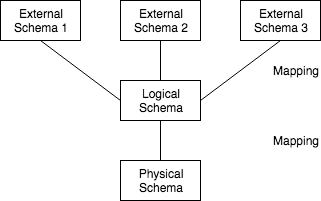 <!-- .element: class="fragment" -->

----

## Schema Languages
- VDL: view definition <!-- .element: class="fragment" -->
- DML: data manipulation <!-- .element: class="fragment" -->
- DDL: data definition <!-- .element: class="fragment" -->
- SDL: storage definition <!-- .element: class="fragment" -->
-------
- All rolled into SQL <!-- .element: class="fragment" -->
    - Except SDL <!-- .element: class="fragment" -->

----

## 3 Tier Architecture
- Client Application(s) <!-- .element: class="fragment" -->
- API (Server) <!-- .element: class="fragment" -->
- Database <!-- .element: class="fragment" -->

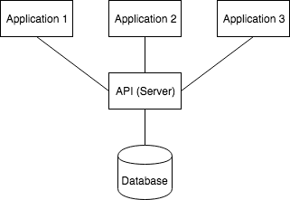 <!-- .element: class="fragment" -->

----

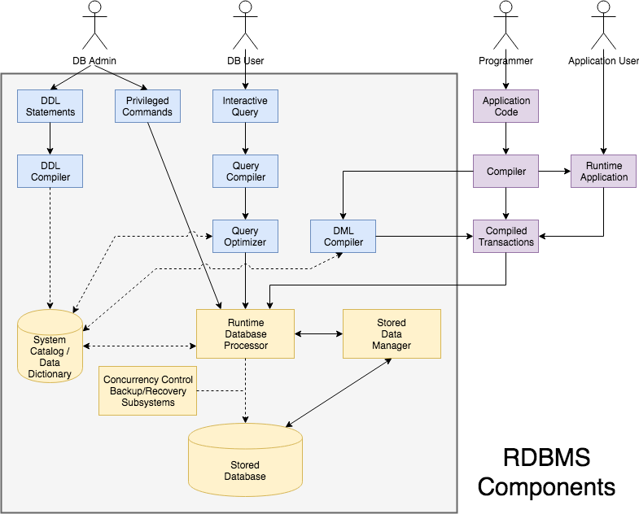

----

## RDBMS Utilities
- Loading <!-- .element: class="fragment" -->
- Backup <!-- .element: class="fragment" -->
- Monitoring <!-- .element: class="fragment" -->
- Reorganization <!-- .element: class="fragment" -->
    - Cleans up mess from deleted rows <!-- .element: class="fragment" -->

---

# Schema Normalization

----

## Rules of Thumb
1. Avoid Ambiguous Attributes
2. Avoid Redundant Data
3. Avoid NULLs
4. Avoid Spurious JOINs

----

## 1. Avoid Ambiguous Attributes
- Semantics of the attributes should be clear <!-- .element: class="fragment" -->
- Design tables that are easy to explain <!-- .element: class="fragment" -->
- Don't mix attributes from multiple entity types in a single relation <!-- .element: class="fragment" -->

----

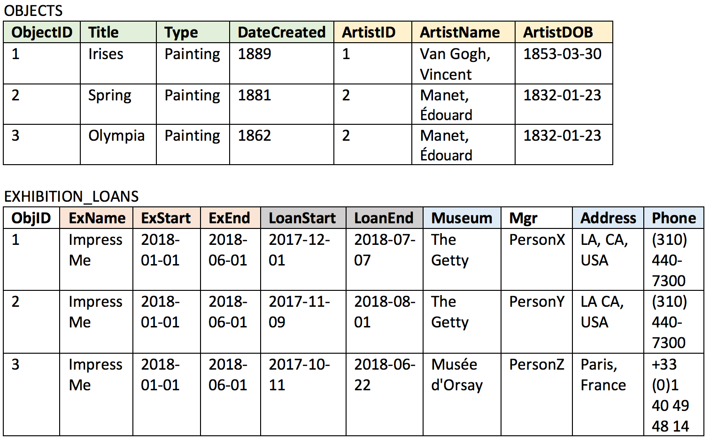

----

## 2. Avoid Redundant Data
- Repeated values wastes storage space <!-- .element: class="fragment" -->
- Also leads to anomalies <!-- .element: class="fragment" -->
    - insertion anomalies <!-- .element: class="fragment" -->
    - deletion anomalies <!-- .element: class="fragment" -->
    - modification anomalies <!-- .element: class="fragment" -->

----

## Insertion Anomalies
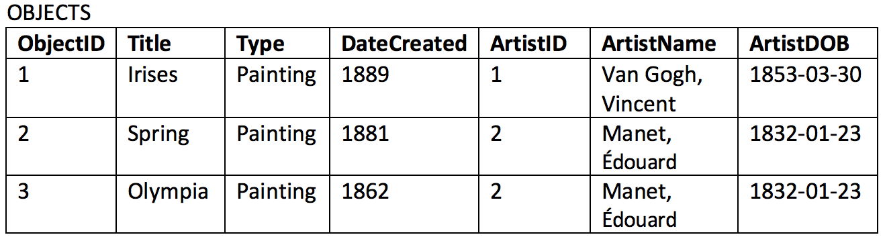
- Inserting an object requires artist data (or NULLs) <!-- .element: class="fragment" -->
    - Prone to inconsistency <!-- .element: class="fragment" -->
- How do you insert an artist w/o an object? <!-- .element: class="fragment" -->
    - Use NULLs <!-- .element: class="fragment" -->
    - After an object is inserted w/ that artist? <!-- .element: class="fragment" -->

----

## Deletion Anomalies

- What if you delete the last object referring to a particular artist? <!-- .element: class="fragment" -->
    - Artist is lost from the database <!-- .element: class="fragment" -->

----

## Modification Anomalies

- What if we update the Manager name for a museum? <!-- .element: class="fragment" -->
    - We must update all of the rows with that museum <!-- .element: class="fragment" -->
    - Leads to inconsistency <!-- .element: class="fragment" -->

----

## 3. Avoid NULLs
- NULLs also waste space <!-- .element: class="fragment" -->
- Can lead to ambiguity when performing: <!-- .element: class="fragment" -->
    - JOINs <!-- .element: class="fragment" -->
    - aggregate operations (count, sum, max) <!-- .element: class="fragment" -->
    - comparisons (WHERE x > y) <!-- .element: class="fragment" -->
- NULLs can have multiple meanings: <!-- .element: class="fragment" -->
    - N/A, unknown, missing <!-- .element: class="fragment" -->

----

## 4. Avoid Spurious JOINs
- Design tables that can be joined on Primary Key-Foreign Key pairs <!-- .element: class="fragment" -->
- Joining on non-prime attributes leads to spurious tuples <!-- .element: class="fragment" -->

----

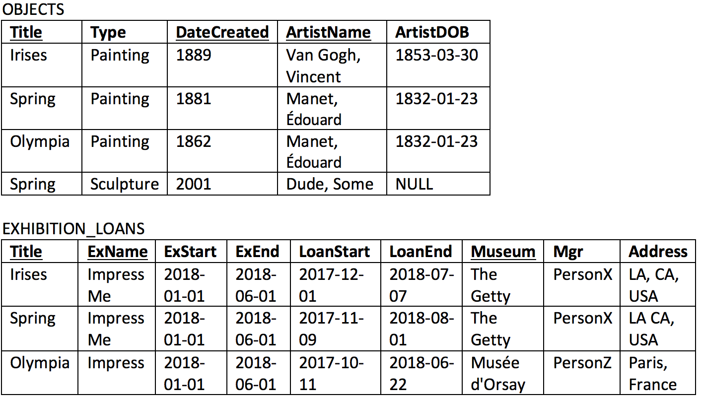

----

### Spurious JOIN

```sql
SELECT o.Title, o.ArtistName, e.Museum 
FROM Objects o, Exhibition_Loans e 
WHERE e.ExName="Impress Me"
AND e.Title = o.Title;
```

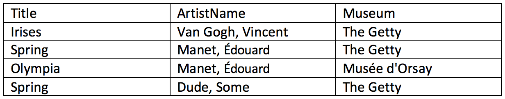

---

# Normalization

----

## Normalization Basics
- A formal method of analysis to minimize redundancy and anomalies <!-- .element: class="fragment" -->
- Has multiples forms (levels), higher is better <!-- .element: class="fragment" -->
- Based on primary keys and functional dependencies <!-- .element: class="fragment" -->
- Normalizing tables individually is not sufficient <!-- .element: class="fragment" -->
    - Taken together, the tables must also ensure nonadditive joins (no spurious tuples) <!-- .element: class="fragment" -->

----

## Functional Dependency (FD)
- A constraint between 2 sets of attributes <!-- .element: class="fragment" -->
- Denoted by X -> Y <!-- .element: class="fragment" -->
    - X and Y can each have more than one attribute <!-- .element: class="fragment" -->
    - Means that the values of Y are determined by the values of X <!-- .element: class="fragment" -->
> For any 2 tuples in the database that have the same set of X values, they must also have the same set of Y values. <!-- .element: class="fragment" -->

----

## Functional Dependencies

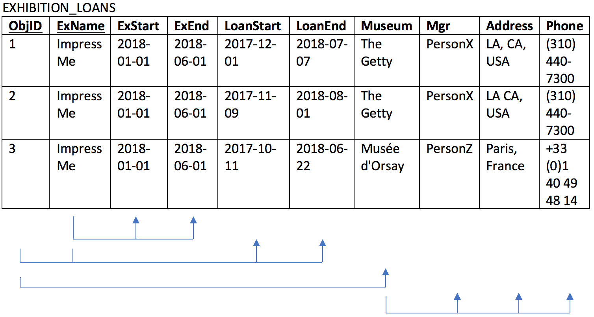

----

## First Normal Form (1NF)
> Values of any attribute must be atomic and singular<!-- .element: class="fragment" -->

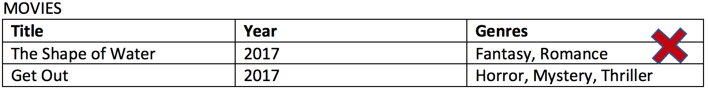 <!-- .element: class="fragment" -->

----

## Techniques for 1NF 
1.  Move the violating attribute to another table <!-- .element: class="fragment" -->
    - e.g. Movies, Genres, HasGenre <!-- .element: class="fragment" -->
    - Decomposition <!-- .element: class="fragment" -->
2.  Repeat the row for each value in the attribute <!-- .element: class="fragment" -->
    - Creates redundancy <!-- .element: class="fragment" -->
3.  Add attributes for each possible value <!-- .element: class="fragment" -->
    - e.g. Genre1, Genre2, Genre3, etc. <!-- .element: class="fragment" -->
    - Must know maximum number of values <!-- .element: class="fragment" -->
    - Creates NULLs <!-- .element: class="fragment" -->

----

## 2nd Normal Form (2NF)
> Every nonprime attribute in a table is fully functionally dependent (FFD) on the primary key <!-- .element: class="fragment" -->

- Nonprime = not part of the primary key (PK)<!-- .element: class="fragment" -->
- FFD = removal of any part of the PK erodes the FD <!-- .element: class="fragment" -->
- Only applies to tables with composite PKs <!-- .element: class="fragment" -->

----

## Technique for 2NF
- Decomposition: new table for each partial key <!-- .element: class="fragment" -->

 <!-- .element: class="fragment" -->

----

## 3rd Normal Form (3NF)
> No nonprime attribute is transitively dependent on the primary key <!-- .element: class="fragment" -->

- i.e. All attributes should be FFD on the PK, not on another attribute <!-- .element: class="fragment" -->

----

## Technique for 3NF
- Decompose: new table for transitive dependencies <!-- .element: class="fragment" -->

 <!-- .element: class="fragment" -->

----

## Boyce-Codd Normal Form (BCNF)

Essentially the same as 3NF, with small addition: <!-- .element: class="fragment" -->

> A nonprime attribute cannot functionally determine a prime attribute <!-- .element: class="fragment" -->

- Any table that is BCNF, is also 3NF <!-- .element: class="fragment" -->
- Most tables in 3NF are also BCNF <!-- .element: class="fragment" -->

----

## 4th Normal Form (4NF)
> A table cannot have a multivalued dependency (MVD) <!-- .element: class="fragment" -->

- MVD: occurs when 2 independent 1:N relationships exist in the same table <!-- .element: class="fragment" -->
    - Results in repeated values <!-- .element: class="fragment" -->
    - Often occurs in all-key tables <!-- .element: class="fragment" -->

----

## Technique for 4NF
- Decompose each dependency into a new table <!-- .element: class="fragment" -->

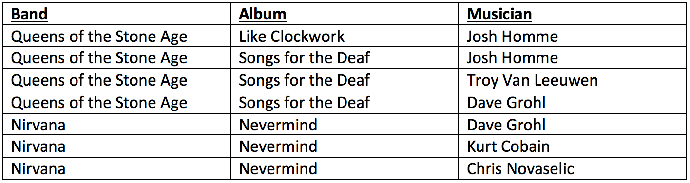 <!-- .element: class="fragment" -->

----

## 5th Normal Form?
- Dont' bother <!-- .element: class="fragment" -->
    - For join depedencies among 3 or more tables <!-- .element: class="fragment" -->
- In practice, most DBAs aim for 3NF, which is critical <!-- .element: class="fragment" -->
- BCNF, 4NF, and 5NF are subtle and rarely needed <!-- .element: class="fragment" -->

---

# More SQL

----

## ON DELETE

What should happen if a foreign key is deleted?

```sql
CREATE TABLE chapter(
    number  INTEGER,
    title   VARCHAR(256),
    bookID  INTEGER REFERENCES book ON DELETE CASCADE
);```

Options include: `SET DEFAULT`, `SET NULL`, `CASCADE`, `RESTRICT`, `NO ACTION`

----

## ON UPDATE

What happens if the foreign key is changed?

e.g. FK is an ISBN, changed from 10 to 13 digits

```sql
CREATE TABLE chapter(
    number  INTEGER,
    title   VARCHAR(256),
    isbn    VARCHAR(15) REFERENCES book.isbn
            ON DELETE CASCADE
            ON UPDATE CASCADE
);```

Same options as `ON DELETE`

----

## ALTER TABLE

Want to rename a table?

```sql
ALTER TABLE actors RENAME TO thesbians;```

What if you want to add or remove a column?

```sql
ALTER TABLE chapter ADD COLUMN pageCount INTEGER;```

```sql
ALTER TABLE chapter DROP COLUMN pageCount;```

`DROP COLUMN` not supported by some DBs

----

## More about SELECT
- `DISTNICT`
- `LIKE`
- `LIMIT` & `OFFSET`

----

## DISTINCT

- Imagine a DB with 3 tables:
    - musician: `id`, `name`
    - album: `id`, `title`, `year`
    - played_on: `musicianID`, `albumID`, `role`
- How do you get all the roles a musician has ever performed without repeats?

```sql
SELECT DISTINCT musician.name, played_on.role
FROM musician, played_on
WHERE played_on.musicianID=musician.id;```

----

## LIKE
- Fuzzy matching for text with regular expressions
- Wildcard Characters
    - `%` represents zero, one, or more characters
    - `_` represents a single character

- e.g. Find books with "information" in the title
```sql
SELECT * FROM book WHERE title LIKE '%information%';```

----

## LIMIT

Too many results? 

`LIMIT` them!

```sql
SELECT * FROM books WHERE title LIKE '%the%' LIMIT 20;```

----

## OFFSET

What if you want to page through the results?

Use `LIMIT` and `OFFSET` together

```sql
SELECT * FROM books WHERE title LIKE '%the%' LIMIT 20 OFFSET 20;```

----

## Nested Queries

- Sometimes you need to perform one query and use the results in another
- You can do that in one statement with nested queries

```sql
SELECT title
FROM album, band
WHERE album.bandid=band.id
AND band.name="Metallica"
AND album.id IN (
    SELECT id
    FROM album
    ORDER BY earnings DESC
    LIMIT 100
    );
```

----

## Aggregate Functions

- Standard SQL has aggregate functions that can be called within a query.
- Each RDBMS also supports it's own functions
- SQLite3 supports these functions:
    - `min(X)`, `max(X)`, `avg(X)`, `sum(X)`, `total(X)`
    - `count(*)`, `count(X)`
    - `group_concat(X, Y)`

```sql
SELECT count(title) FROM films;```

```sql
SELECT max(earnings), avg(earnings) FROM films;```

----

## OUTER JOINs

- What happens when you make a query using a FK that can have NULLs?
    - If you use a `NATURAL INNER JOIN` (aka equijoin), the rows with NULLs will not be included

```sql
SELECT bookt.title, author.name
FROM book, author
WHERE book.authorid=author.id;```

- If you want to include rows with NULLs you have to do an `OUTER JOIN`

----

## OUTER JOINS

- To keep all the elements from the first table use a `LEFT OUTER JOIN`

```sql
SELECT book.title, author.name
FROM book 
LEFT OUTER JOIN ON book.authorid=author.id;```

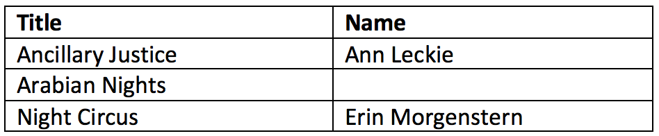

----

## OUTER JOINS

- To keep all the elements from the second table use a `RIGHT OUTER JOIN`

```sql
SELECT book.title, author.name
FROM book 
RIGHT OUTER JOIN ON book.authorid=author.id;```

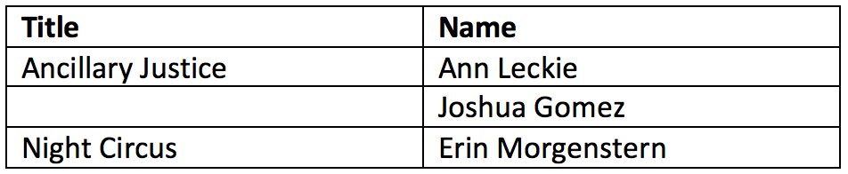

----

## OUTER JOINS

- To keep all the elements from both tables use a `FULL OUTER JOIN`

```sql
SELECT book.title, author.name
FROM book 
FULL OUTER JOIN ON book.authorid=author.id;```

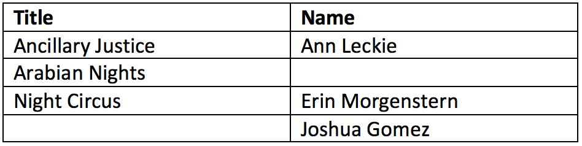

----

## GROUP BY

- You can arrange your results in groups
- This works well with aggregate functions

```sql
SELECT count(id), genre
FROM albums
GROUP BY genre
ORDER BY count(id) DESC;```

----

## HAVING

- What if you want to add a condition based on the aggregate function?
- Use the `HAVING` clause

```sql
SELECT count(id), genre
FROM albums
GROUP BY genre
HAVING count(id) > 1000
ORDER BY count(id) DESC;```

---

# EOL

On to the exercise! <!-- .element: class="fragment" -->

After a break <!-- .element: class="fragment" -->
