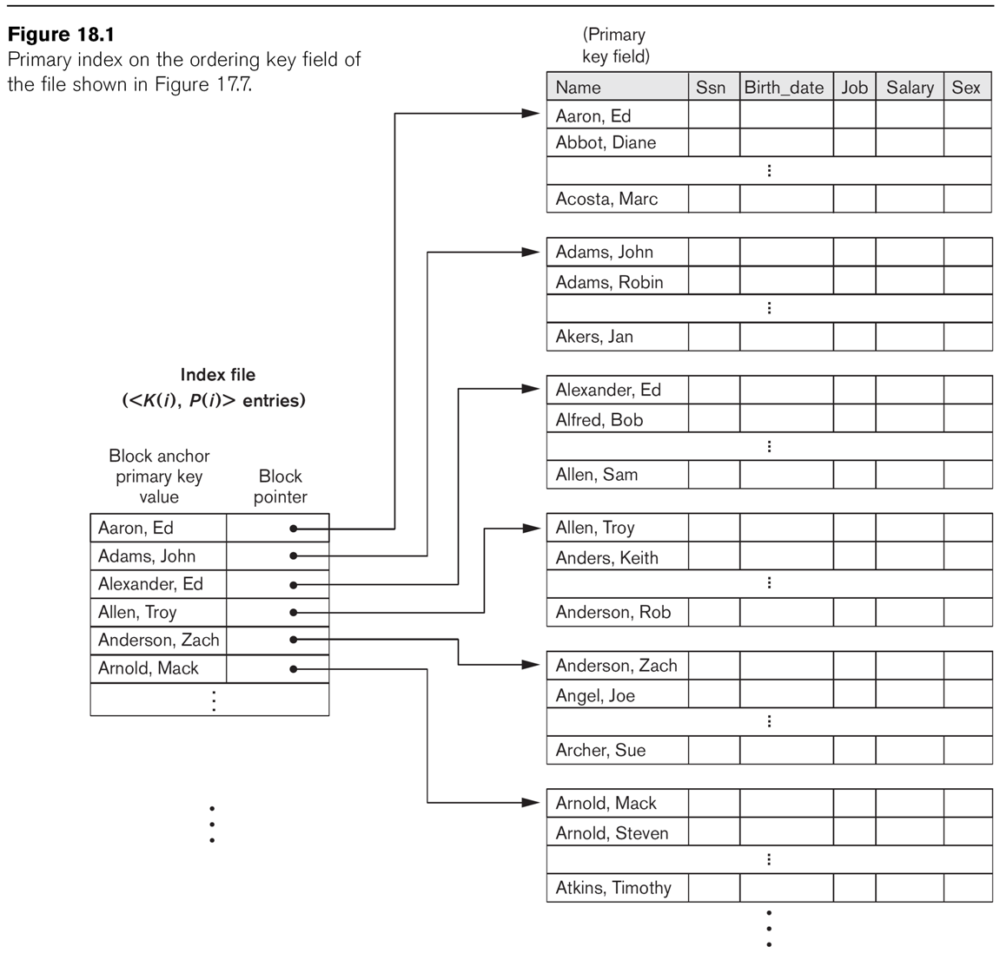
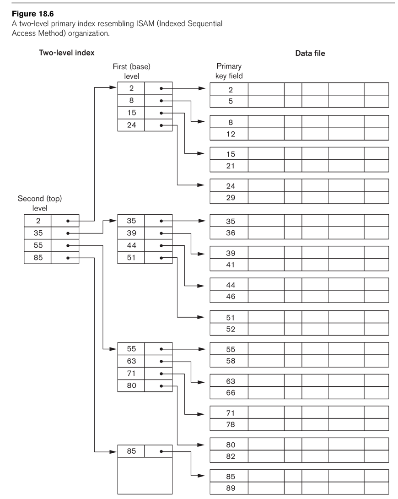

# Week 5

Indexes (take 2) <!-- .element: class="fragment" -->

Distributed Databases <!-- .element: class="fragment" -->

Advanced SQL <!-- .element: class="fragment" -->

---

# Indexes

This time with pictures! <!-- .element: class="fragment" -->

----

## Types of Indexes

- Single Level 
    - Primary Index
    - Clustering
    - Secondary
- Multilevel
- Dynamic

----

## Index Basics

- Index file stores 2 things: <!-- .element: class="fragment" -->
    - values of the indexed field <!-- .element: class="fragment" -->
    - pointers to disk blocks in the data file <!-- .element: class="fragment" -->
- Index values are sorted <!-- .element: class="fragment" -->
    - enables binary search <!-- .element: class="fragment" -->
    - faster than linear search for unordered data file <!-- .element: class="fragment" -->
    - also faster than ordered data file due to size <!-- .element: class="fragment" -->

----

## Primary Indexes

- Index on the ordering key field of the data <!-- .element: class="fragment" -->
- One index entry for each data block <!-- .element: class="fragment" -->
    - Not each row! <!-- .element: class="fragment" -->
    - These are called block anchors <!-- .element: class="fragment" -->
- This makes it a "sparse" index <!-- .element: class="fragment" -->
    - Makes the index smaller, therefore faster to search <!-- .element: class="fragment" -->
- Index is smaller also because of fewer fields <!-- .element: class="fragment" -->

----

 <!-- .element height="65%" width="65%" -->

----

## Clustering Indexes

- Data file ordered on a non-key field <!-- .element: class="fragment" -->
    - Called the clustering field <!-- .element: class="fragment" -->
    - This is unusual, but use cases do exist for it <!-- .element: class="fragment" -->
- Index has one entry per unique value in the cluster <!-- .element: class="fragment" -->
- Each entry points to data file block with first instance of that value <!-- .element: class="fragment" -->
- This is also a sparse index <!-- .element: class="fragment" -->

----

 <!-- .element height="65%" width="65%" -->

----

## Secondary Indexes

- You can create indexes on more than just the primary or ordering fields <!-- .element: class="fragment" -->
- Secondary indexes may be created for key or non-key fields <!-- .element: class="fragment" -->
    - On a key field --> 1 entry / row (dense) <!-- .element: class="fragment" -->
    - On a non-key field --> 1 entry / unique value (sparse) <!-- .element: class="fragment" -->
        - Can be implemented with variable length lists or second level of block pointers <!-- .element: class="fragment" -->

----

 <!-- .element height="65%" width="65%" -->

----

 <!-- .element height="65%" width="65%" -->

----

## Multilevel Indexes

- Imagine that a very large database results in very large indexes <!-- .element: class="fragment" -->
    - Speed things up by creating an index for the index! <!-- .element: class="fragment" -->
        - And then an index for the index for the index! <!-- .element: class="fragment" -->
----

 <!-- .element height="65%" width="65%" -->

----

## Dynamic Indexes

- All indexes shown so far suffer when updating <!-- .element: class="fragment" -->
- Dynamic indexes address this with special search trees <!-- .element: class="fragment" -->
- What's a tree? <!-- .element: class="fragment" -->
    - Data structure made of nodes <!-- .element: class="fragment" -->
    - Each node has one parent, except the root <!-- .element: class="fragment" -->
    - Nodes with no childrens are leaf nodes <!-- .element: class="fragment" -->
    - A balanced tree has all its children at the same level <!-- .element: class="fragment" -->
- B-trees are search trees that ensure it remains balanced <!-- .element: class="fragment" -->
    - example: https://www.cs.usfca.edu/~galles/visualization/BTree.html <!-- .element: class="fragment" -->

---

# Distributed Databases

----

## What does distributed database mean? <!-- .element: class="fragment" -->
- Multiple database nodes connected by a computer network <!-- .element: class="fragment" -->
- The database are logically interrelated <!-- .element: class="fragment" -->
- Nodes are not necessarily identical <!-- .element: class="fragment" -->
    - hardware may be different <!-- .element: class="fragment" -->
    - software may be different <!-- .element: class="fragment" -->
    - even the data may be different! <!-- .element: class="fragment" -->

----

## Benefits DDBs
- Increased Reliability & Availability <!-- .element: class="fragment" -->
    - Fault Isolation <!-- .element: class="fragment" -->
    - Data Replication <!-- .element: class="fragment" -->
- Improved Performance <!-- .element: class="fragment" -->
    - Data Localization <!-- .element: class="fragment" -->
        - Smaller datasets and fewer queries <!-- .element: class="fragment" -->
    - Query parallelization <!-- .element: class="fragment" -->
- Scalability <!-- .element: class="fragment" -->

----

## Drawbacks of DDBs

- Increased complexity <!-- .element: class="fragment" -->
    - Data distribution & replication mgmt <!-- .element: class="fragment" -->
    - Distributed query & transaction processing <!-- .element: class="fragment" -->
    - Recovery <!-- .element: class="fragment" -->

----

## Fragmentation (Partitions)

- Allocation of data to different nodes <!-- .element: class="fragment" -->
- Could be done at the table level <!-- .element: class="fragment" -->
    - Node 1 gets tables A, B, and C <!-- .element: class="fragment" -->
    - Node 2 gets tables X, Y, and Z <!-- .element: class="fragment" -->
- However, it is usually done within the table <!-- .element: class="fragment" -->
    - Slice up the table horiontally or vertically <!-- .element: class="fragment" -->
    - Can be useful even on a non-distributed database <!-- .element: class="fragment" -->

----

## Horizontal Partitions

- Group the rows in a table on some attribute <!-- .element: class="fragment" -->
    - Usually an attribute used for filtering <!-- .element: class="fragment" -->
    - e.g. partition books by language <!-- .element: class="fragment" -->
    - Common use cases: <!-- .element: class="fragment" -->
        - Time span segmentation <!-- .element: class="fragment" -->
        - Geographic/Regional segmentation <!-- .element: class="fragment" -->
- Slices the table horizontally <!-- .element: class="fragment" -->
- Often useful to partition related tables <!-- .element: class="fragment" -->
    - e.g. partition authors by their books' languages <!-- .element: class="fragment" -->
    - Called "derived partitioning" <!-- .element: class="fragment" -->

----

## Vertical Partitions

- Group the columns into multiple tables <!-- .element: class="fragment" -->
    - Each new table still needs the primary key <!-- .element: class="fragment" -->
- Reduces table to most frequently needed data <!-- .element: class="fragment" -->
- A mixed fragmentation uses both vertical & horizontal <!-- .element: class="fragment" -->

----

## PostgreSQL Partitions

```sql
CREATE TABLE measurement (
    city_id         int not null,
    logdate         date not null,
    peaktemp        int,
    unitsales       int
) PARTITION BY RANGE (logdate);
```

```sql
CREATE TABLE measurement_y2006m02 PARTITION OF measurement
    FOR VALUES FROM ('2006-02-01') TO ('2006-03-01');

CREATE TABLE measurement_y2006m03 PARTITION OF measurement
    FOR VALUES FROM ('2006-03-01') TO ('2006-04-01');

...
```

```sql
CREATE INDEX ON measurement_y2006m02 (logdate);
CREATE INDEX ON measurement_y2006m03 (logdate);
...
```

---

# More SQL

----

## Common Table Expressions (CTE)

- Define temporary tables that exist for a single query <!-- .element: class="fragment" -->
- Uses the WITH keyword <!-- .element: class="fragment" -->
    - Gives a name to a table created by an inline statement <!-- .element: class="fragment" -->
    - Can name more than one temp table <!-- .element: class="fragment" -->

----

## CTE Example

```sql
WITH regional_sales AS (
        SELECT region, SUM(amount) AS total_sales
        FROM orders
        GROUP BY region
     ), top_regions AS (
        SELECT region
        FROM regional_sales
        WHERE total_sales > (SELECT SUM(total_sales)/10 FROM regional_sales)
     )
SELECT region,
       product,
       SUM(quantity) AS product_units,
       SUM(amount) AS product_sales
FROM orders
WHERE region IN (SELECT region FROM top_regions)
GROUP BY region, product;
```

----

## Advanced CTE

Recursive CTEs

```sql
WITH RECURSIVE t(n) AS (
    VALUES (1)
  UNION ALL
    SELECT n+1 FROM t WHERE n < 100
)
SELECT sum(n) FROM t;
```

Data-Modifying CTEs

```sql
WITH moved_rows AS (
    DELETE FROM products
    WHERE
        "date" >= '2010-10-01' AND
        "date" < '2010-11-01'
    RETURNING *
)
INSERT INTO products_log
SELECT * FROM moved_rows;
```

----

## Window Functions

- Calculates across rows related to the current row
- Aggregate queries without collapsing into groups

```sql
SELECT depname, empno, salary, 
       avg(salary) OVER (PARTITION BY depname)
FROM empsalary;
```

```sql
depname  | empno | salary |          avg          
-----------+-------+--------+-----------------------
 develop   |    11 |   5200 | 5020.0000000000000000
 develop   |     7 |   4200 | 5020.0000000000000000
 develop   |     9 |   4500 | 5020.0000000000000000
 develop   |     8 |   6000 | 5020.0000000000000000
 develop   |    10 |   5200 | 5020.0000000000000000
 personnel |     5 |   3500 | 3700.0000000000000000
 personnel |     2 |   3900 | 3700.0000000000000000
 sales     |     3 |   4800 | 4866.6666666666666667
 sales     |     1 |   5000 | 4866.6666666666666667
 sales     |     4 |   4800 | 4866.6666666666666667
(10 rows)
```

----

## More Window Functions

Can also control the order of processing

```sql
SELECT depname, empno, salary,
       rank() OVER (PARTITION BY depname ORDER BY salary DESC)
FROM empsalary;
```

```sql
  depname  | empno | salary | rank 
-----------+-------+--------+------
 develop   |     8 |   6000 |    1
 develop   |    10 |   5200 |    2
 develop   |    11 |   5200 |    2
 develop   |     9 |   4500 |    4
 develop   |     7 |   4200 |    5
 personnel |     2 |   3900 |    1
 personnel |     5 |   3500 |    2
 sales     |     1 |   5000 |    1
 sales     |     4 |   4800 |    2
 sales     |     3 |   4800 |    2
(10 rows)
```

----

# EOL

