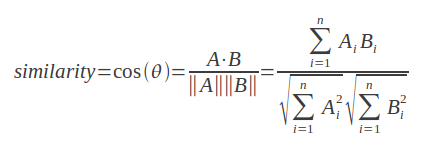

# Week 06

Information Retrieval Systems

---

# Basic Concepts

----

## What is Information Retrieval?

> The process of retrieving documents from a collection in response to a query by a user.

----

## DB vs IR

| Database | IR System |
| --------- | ---------- |
| Structured Data | Unstructured |
| Relational Schemas | Schemaless (sometimes) |
| Structured Queries | Free form queries |
| Rich metadata | Rich data |
| Returns data | Returns documents |
| Exact match | Approximate |

----

## Classifying IR Systems

- By Users <!-- .element: class="fragment" -->
    - expert vs layperson <!-- .element: class="fragment" -->
- By Scale <!-- .element: class="fragment" -->
    - desktop, enterprise, web <!-- .element: class="fragment" -->
- By Data <!-- .element: class="fragment" -->
    - general vs topical <!-- .element: class="fragment" -->
- By Need <!-- .element: class="fragment" -->
    - Navigational, Informational, Transactional <!-- .element: class="fragment" -->
- By Model <!-- .element: class="fragment" -->
    - Boolean, Vector Space, Probabilistic <!-- .element: class="fragment" -->

----

## General Framework

----

## Simplified Process

---

# Indexing

----

## Indexing

- Just like DBs, we want to avoid sequential scan <!-- .element: class="fragment" -->
- Each document is "tokenized" into vocabulary terms <!-- .element: class="fragment" -->
- Terms can be: <!-- .element: class="fragment" -->
    - individual words
    - phrases or n-grams <!-- .element: class="fragment" -->
    - entities or names <!-- .element: class="fragment" -->
    - links <!-- .element: class="fragment" -->
    - dates <!-- .element: class="fragment" -->
    - whatever is important to your use case <!-- .element: class="fragment" -->

----

## The Document Index

Has an entry for each document

Lists every word in it and the position(s) of it in the doc

| DocID | Terms |
| ----- | ----- |
| 1 | "can":[4], "i":[1,3], "think":[2] |
| 2 | "be":[2,6], "not":[4], "or":[3], "to":[1,5] |
| 3 | "a":[4], "am":[2], "crook":[5], "i":[1], "not":[3]

----

## The Inverted Index

Has an entry for each term

Lists each document it appears in (and positions)

| Term | Documents |
| ---- | --------- |
| ...  | ... |
| be | 1:[2,6] |
| ... | ... |
| i | 1:[1,3], 3[1] |
| ... | ... |
| not | 2:[4], 3:[3] |

---

# Modeling

----

## Modeling Methods

- Statistical (just bags of words) <!-- .element: class="fragment" -->
    - Boolean <!-- .element: class="fragment" -->
    - Vector Space <!-- .element: class="fragment" -->
    - Probabilistic <!-- .element: class="fragment" -->
- Semantic (extracts meaning) <!-- .element: class="fragment" -->

----

## Boolean Model

- Docs are a set of terms
- Queries are a set of terms
    - Combined with Boolean operators
    - `AND`, `OR`, `NOT`, `()`, `+`, `-`
- Retrieval is binary
    - Exact match only
    - No ranking of results
- Examples
    - Systems: LexisNexus
    - Query: `Obama AND campaign - Romney`
- Some systems also support nearness parameters

----

## Vector Space Model

- Gives weights to terms (per document)
- Enables ranking of results
- Each document and query is a vector of weighted terms
    - A very high dimensionality
- Ranking is based on the simliarity beween the vector of the query and the vectors of each document

----

## What is a vector?

> A Euclidean vector is a geometric object that has magnitude and direction. [Wikipedia](https://en.wikipedia.org/wiki/Euclidean_vector)

Direction and magnitiude are determined by 3 component vectors in 3 dimensional space.

----

## Document Vectors

- A document vector has 1 dimension per term  <!-- .element: class="fragment" -->
    - Per term in the entire corpus, not just in the document! <!-- .element: class="fragment" -->
- The terms are weighted proportionally <!-- .element: class="fragment" -->
    - Some docs are longer than others --> more words <!-- .element: class="fragment" -->
    - 10 occurrences in a short doc are more significant than 10 occurrences in a long document <!-- .element: class="fragment" -->
- Queries are also treated as vectors <!-- .element: class="fragment" -->
- Compare "similarity" of vectors to determine rankings <!-- .element: class="fragment" -->

----

## Cosine Similarity

- Measure the cosine of the angle between query and document vectors <!-- .element: class="fragment" -->
- As angle decreses, cosine approaches 1 <!-- .element: class="fragment" -->
- Cosine Similarity Function: <!-- .element: class="fragment" -->
 
 <!-- .element: class="fragment" -->

----

## Term Weighting

- Common method used is called TF-IDF  <!-- .element: class="fragment" -->
- Term Frequency (TF) <!-- .element: class="fragment" -->
    - How often does the term appear in this doc? <!-- .element: class="fragment" -->
    - We assume a high TF signifies importance  <!-- .element: class="fragment" -->
- Inverse Document Frequency (IDF) <!-- .element: class="fragment" -->
    - How many documents does the term appear in? <!-- .element: class="fragment" -->
    - We assume spare appearance makes it significant <!-- .element: class="fragment" -->

 <!-- .element: class="fragment" -->

----

## Probabilistic Model

- Attempts to determine probability of relevance (`R`) and non-relavance (`NR`) of a given document (`D`) 
- Uses Naive Baye's Theorem 
    - `P(R|D)  = P(D|R)  x P(R)/P(D)` 
    - `P(NR|D) = P(D|NR) x P(NR)/P(D)` 
- Doc is relevant if: `P(R|D) > P(NR|D)` 
- Use ratio of `P(D|R)/P(D|NR)` for ranking 
    - Pretty much boils down to TF-IDF with various scaling factors 

----

## Okapi BM25 Model

----

## Semantic Model

- Bags of words models can miss the point of a query <!-- .element: class="fragment" -->
    - They are very literal <!-- .element: class="fragment" -->
- Semantic models extract meaning, not just terms <!-- .element: class="fragment" -->
- Employs methods from NLP, AI, Expert Systems <!-- .element: class="fragment" -->
- Uses complex knowledge bases and heuristics <!-- .element: class="fragment" -->
    - Example: [WordNet](http://wordnetweb.princeton.edu/perl/webwn) <!-- .element: class="fragment" -->
- Analyzes: <!-- .element: class="fragment" -->
    - Morphology: word roots and parts of speech <!-- .element: class="fragment" -->
    - Syntax: phrase and sentence structure <!-- .element: class="fragment" -->
    - Semantics: relationships between entities <!-- .element: class="fragment" -->

---

# Preprocessing

----

## Tokenization

- Converting text into "terms" <!-- .element: class="fragment" -->
- Simple case, words split by whitespace <!-- .element: class="fragment" -->
- Stemming <!-- .element: class="fragment" -->
    - Converts words to morphological root <!-- .element: class="fragment" -->
    - e.g. "learn", "learning", "learned", "learns" <!-- .element: class="fragment" -->
- Remove stop words (the, of, to , a, and , in ...) <!-- .element: class="fragment" -->
    - Greatly reduces size of index <!-- .element: class="fragment" -->
    - What happens to "To be or not to be?" <!-- .element: class="fragment" -->
    - Not used much any more <!-- .element: class="fragment" -->
- N-grams <!-- .element: class="fragment" -->
    - build tokens based on 2 or 3 sequential words <!-- .element: class="fragment" -->
    - Gets abck to the "nearness" quality <!-- .element: class="fragment" -->

----

## Information Extraction

- Use a thesaurus to get synonyms 
    - Or to translate 
    - Example: [ULAN](http://www.getty.edu/vow/ULANFullDisplay?find=mucha&role=&nation=&prev_page=1&subjectid=500030136) 
    - Example: [AAT](http://www.getty.edu/vow/AATFullDisplay?find=concrete&logic=AND&note=&english=N&prev_page=1&subjectid=300010737) 
    - Can cause errors (e.g. "bank") 
- Pattern matching on structured content 
    - phone numbers and URLs 
    - tables of data 
- NLP & NER (named entity recognition) 
    - Identifies things 
    - Useful for automated categorization 
    - Practical use of semantic model methods 

---

# Evaluation

----

## Relevance

- Topical relevance <!-- .element: class="fragment" -->
    - Topic of the result matches the topic of the query <!-- .element: class="fragment" -->
    - Binary: relevant or not relevant <!-- .element: class="fragment" -->
    - Narrow in scope <!-- .element: class="fragment" -->
- User relevance <!-- .element: class="fragment" -->
    - Does it satisfy the user's information need? <!-- .element: class="fragment" -->
    - Accounts for: <!-- .element: class="fragment" -->
        - context <!-- .element: class="fragment" -->
        - timeliness <!-- .element: class="fragment" -->
        - environment <!-- .element: class="fragment" -->
        - etc. <!-- .element: class="fragment" -->
    - Difficult ot measure <!-- .element: class="fragment" -->

----

## Recall & Precision

- Recall:  <!-- .element: class="fragment" -->
    - \# of relevant docs retrieved divided by total \# of relevant docs <!-- .element: class="fragment" -->
    - i.e. What fraction of the relevant docs in the whole collection did you get? <!-- .element: class="fragment" -->
- Precision: <!-- .element: class="fragment" -->
    - \# of relevant docs retrieved divided by total # of docs retrieved <!-- .element: class="fragment" -->
    - i.e. Of the docs retrieved, what fraction are actually relevant? <!-- .element: class="fragment" -->

----

## Hits & Misses Matrix

----

## Precision vs Recall

----

## F-Score

- F-Score: "harmonic mean" of precision and recall <!-- .element: class="fragment" -->
    - Used to compare different result sets <!-- .element: class="fragment" -->
- Formula: <!-- .element: class="fragment" -->
    - `F = 2pr/(p+r)` <!-- .element: class="fragment" -->
- Simplifies to: <!-- .element: class="fragment" -->
    - `F = 2/(1/p + 1/r)` <!-- .element: class="fragment" -->

---

# EOL