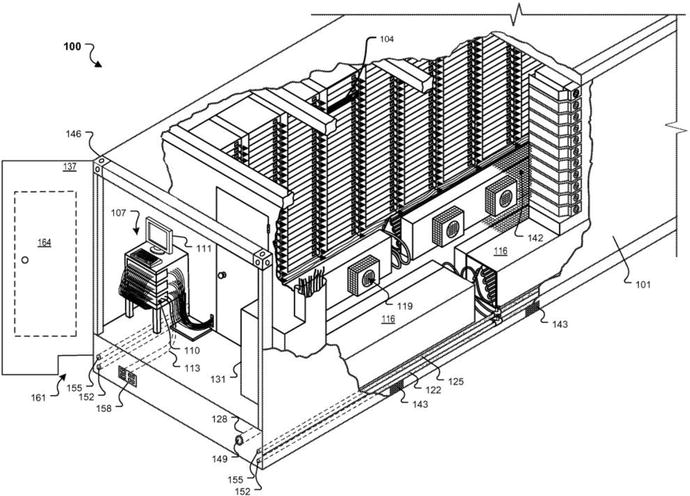
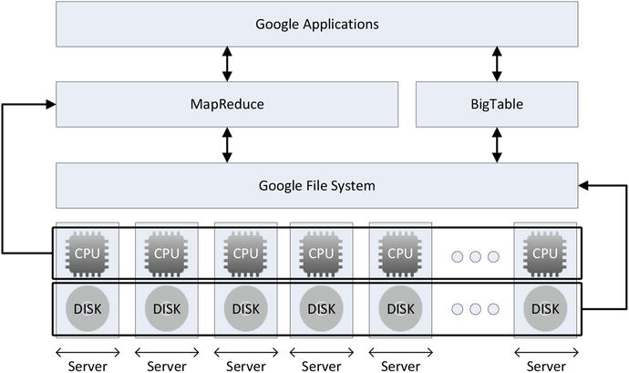
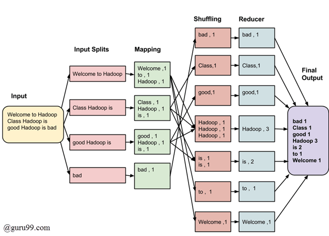
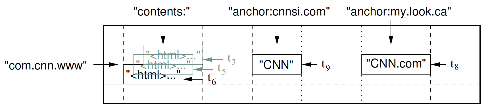
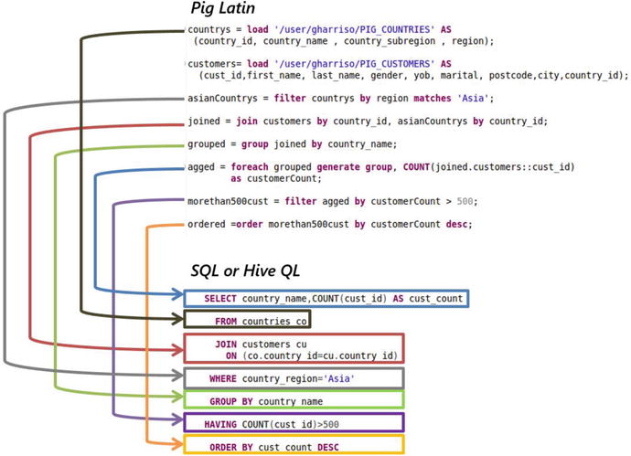

# Week 7

Big Data & Google's Big Table

Hadoop & HBase

---

# Database Revolutions

----

## Early Databases

- Databases existed before computers
    - Structured books (e.g. encyclopedias)
    - Libraries
    - Census punch cards
- Improvements came with electronic computers
    - Indexing (ISAM) enabled fast record-based access
    - Also enabled first OLTP systems
    - But everything was controlled by the application
        - No DB Mgmt Systems
        - Lots of reinventing the wheel and complex code

----

## 1st Database Revolution

- Creation of Database Management Systems
    - Separated application logic from DB handling
    - Run on mainframes
    - Two competing models: Hierarchical & Network
        - Referred to as "navigational" systems
        - Get from one type of record to another via links
- Drawbacks
    - Inflexible data structures and query capabilities
    - Focused on single record CRUD operations
        - Could not support aggregate analytics
        - Required custom code to produce reports

----

## 2nd Database Revolution

- Pillars of relational databases
    1. Relational model: Ted Codd, early 1970's
        - Relations, tuples, attributes, constraints, ops
    2. ACID Transactions: Jim Gray, late 1970's
    3. SQL Language: IBM, System R, 1974
        - Standardized in 1986
- Great for client-server model of early Internet apps
- Maintained superiority for 30 years
    - Survived threat from object-oriented model

----

## 3rd Database Revolution

- Big Data (industrial revolution of data)
    - IT trends: cloud, mobile, social media
    - External data: customers & sensors
    - Analytics (artificial & collective intelligence)
- RDBMS cannot handle "web-scale"
    - Early solutions: Caching, Replication, Sharding
    - These introduce latency or loss of functionality
- Google had to invent new hardware and software
    - 2003: GFS, a distributed file system
    - 2004: MapReduce, a parallel processing algorithm
    - 2006: BigTable, a distributed database

----

## Non-relational Explosion

- Large scale transactions: Amazon's DyanmoDB
- Social media infrastructure: Facebook's Cassandra
- Popularity of JSON -> MongoDB
    - Similar motivations as OODBMS
- Stonebreaker: "End of an Architectural Era"
    - Hardware assumptions no longer apply
    - Single architecture not optimal for variety of workloads
        - i.e. "one size does not fit all"

---

# Google & Hadoop

----

## PageRank

- Google's algorithm dominated search
- Ranking is not just about relevance
- Ranking also depends on "quality" of the page
    - Is it auhtoritative?
    - How to determine authority?
        - How many other site point to it?
- Pitfalls exist when equating Authority and Popularity
    - But it is still very effective
- So how do you store/use all those pages and links?

----

## Google Hardware

- No big expensive servers
- Massively distributed processing on commodity servers
- "Build, don't buy" (both hardware and software)
- Servers not the fundamental unit of computing
    - Google Modular Data Centers house ~1000 servers
- No separtion of storage and processing
    - Each server has directly attached disks

----

## Google Hardware

----

## Google Software Stack

- No OS or DB can operate on that many servers
- So Google created their own stack
    - GFS: distributed file system
        - Treats all those disks as one large file system
    - MapReduce: distributed processing
        - Parallelize processing of massive datasets
    - BigTable: nonrelatoinal database
        - Uses GFS for storage

----

## Google Software Stack

----

## MapReduce

- Runs in 4-5 steps
    1. Split the data and send it to multiple machines
    2. Each machine runs a mapping function on the data
    3. The data is then shuffled or sorted
    4. The sorted data is then put through a reducing function
    5. The reduced data is further reduced or merged

----

## MapReduce

----

## BigTable

- Goals: 
    - wide applicability
    - scalability
    - high performance
    - high availability
- Used by: Search, Earth, Finance, Analytics
- Not a relational DB, just one big "table"
- "Sparse, distributed, persistent, multidimensional, sorted map"

----

## BigTable Data Model

- Map is indexed by row key, column key & timestamp
- Values are uninterpreted strings
- (row:string, column:string, time:int64) -> string
- Every read/write on a single row is atomic
- Sorted by row key
    - Dynamically partitioned into tablets
    - Efficient short range reads (fewer machines)
        - Depending on proper row key naming

----

## BigTable Data Model

- Column keys grouped into sets called families
    - Families are the basic unit of access control
    - syntax: `family:qualifier`
- Number of families should be small (hundreds)
- Number of columns in a family is unbounded
- Cells contain multiple versions of the same data
    - Indexed by timestamp
    - Most recent read first
- Clients determine how many versions to keep
    - Or how how long to keep versions

----

## BigTable Data Model

----

## BigTable Refinements

- Clients can create locality groups
    - Groups some families together for faster reads
    - Can also declare it to be kept in memory
- Compression can also be specified by the client
    - Often achives 10-1 reduction (GZip gets 3-1)
    - Because boilerplate HTML in the same tablet
    - Even better on versions of the same page
- Two level caching
    - Scan cache of key-value pairs
        - Good for frequent reads of same data
    - Block cache good for reading "nearby" data

----

## Hadoop & HBase

- 2007: Open source implementation of Google's stack
- Adopted and sponsored by Yahoo! and Facebook
- Synonymous with Big Data
- Ecosystem:
    - HDFS, HBase, Zookeeper, many more
- Relatives:
    - Kafka, Mahout, Spark

----

## Querying on Hadoop

- HBase is a key-value map
- No query language; must run MapReduce jobs
    - This can be a pain for non-progammers
- Two primary solutions to this problem
    - Hive (Facebook)
        - Provides the Hive Query Language (HQL)
        - Translates SQL-like queries into MapReduce
    - Pig (Yahoo!)
        - Provides PigLatin
        - Procedural, not declarative

----

## Querying on Hadoop

----

## Conclusion

- Benefits of Hadoop:
    - Economical (runs on commodity hardware)
    - Scalable IO (fewer disks per cpu)
    - Reliability (replication of data)
    - Scalable Processing (MapReduce)
    - Flexibility: "Schema on Read"
- Drawbacks
    - No transactions (beyond a single row)
    - No online operations
    - Led to ... (next week's lecture)

---

# EOL

