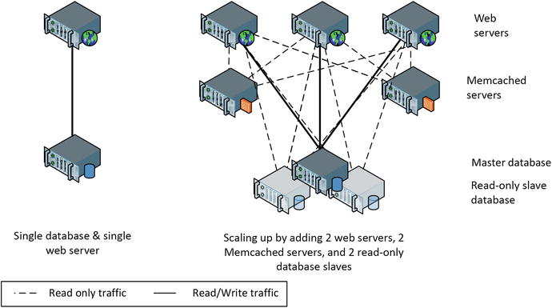
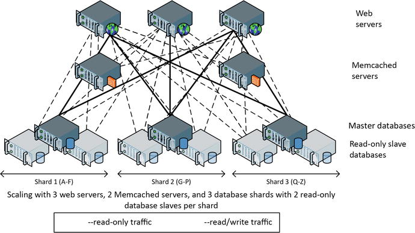
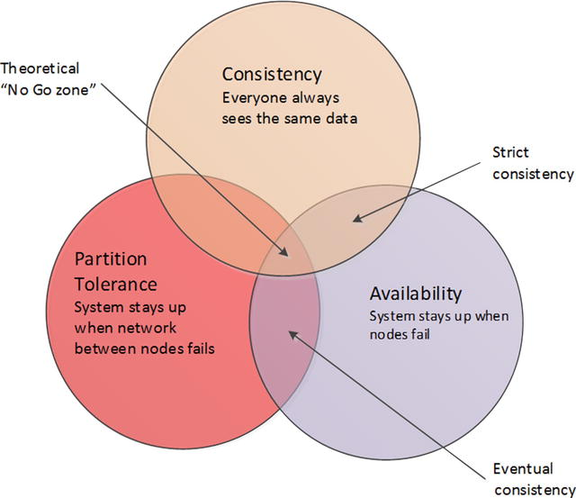
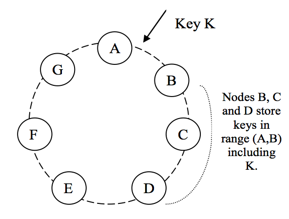
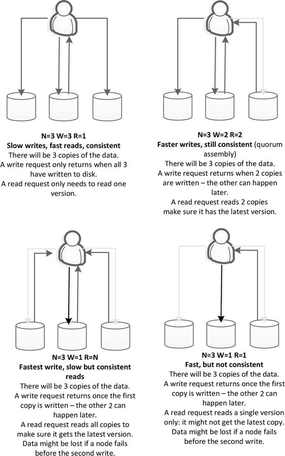
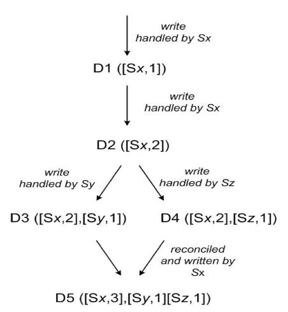

# Week 08

Keystores

Amazon's Dynamo

---

# Scaling RDBMSs

----

## Web 2.0

- Original web was interlinked static documents
- Rise of e-Commerce sites made it more dynamic
- Interactive sites used CGI
    - Common Gateway Interface
    - HTTP requests would invoke a script on the server
        - Often in Perl, ASP, PHP
    - Script would change HTML based on database content

----

## Bottlenecks in Web 2.0

- Recall the 3 tier layered architecture
    - Client <-> Server <-> DB
- What do you do if client traffic increases?
    - Add more web servers!
- What if the bottleneck is in the DB layer?
    - No scalable DBs existed
    - Only option: buy powerful DB server
- This method eventually failed
    - Too expensive (see dotcom crash)
    - No DB server powerful enough
    - Single point of failure

----

## Workarounds

- After dotcom crash, open source became popular
    - Linux (operating system)
    - Apache httpd (web server) 
    - MySQL (database)
- MySQL not as powerful as Oracle, but improved by:
    - Caching with Memcached
        - Reduces number of DB calls
    - Replication
        - Distributes reads across repilcas
- Both improve performance of reads but not writes

----

## Caching & Replication

----

## Last Resort: Sharding

- Partition table by keys into multiple shards
- Distribute shards across multiple DB servers
- Can greatly improve performance
- In 2011 Facebook was using 4,000 shards of MySQL
    - And 9,000 Memcached servers
    - 1.4 billion reads/sec (peak)
    - 3.5 million row changes/sec
    - 8.1 million physical IOs/sec

----

----

## Drawbacks of Sharding

- Complexity
    - App must route requests to correct shard
        - Difficult to manage with growing website
    - Load balancing becomes problematic
        - Adding new shards means rebalancing
        - Changin scheme must be rolled out
- Loss of DB features
    - No JOIN, GROUP BY
        - Only programmers can query the DB
    - No transactions across multiple shards

----

## CAP Theorem

- Oracle tried to create a scalable RDBMS
    - Too expensive & never scaled enough
- CAP Theorem proved it impossible in 2000
    - A distributed DB can have only 2 of
        - Consistency
            - Data is the same on all replicas
        - Availability
            - DB operates despite failures
        - Partition Tolerance
            - Works despite network loss between nodes
    - An illustrated [explanation](https://mwhittaker.github.io/blog/an_illustrated_proof_of_the_cap_theorem/)

----

## Eventual Consistency

- Global sites made partition tolerance a real issue
    - But the sites needed to be always available
- CAP Theorem says you must give up consistency
    - But not forever
- Many apps can tolerate delayed propogation
    - Fine for social networks, not banks
 - "Eventual consistency" is basis of many NoSQL solutions
    - Amazon's Dynamo
    - Facebook's Cassandra

----

---

# Dynamo

----

## Amazon's Goals

- Continuous Availability (don't lose money)
- Network Partition Tolerance (global store)
- No-loss conflict resolution (keep shopping!)
- Efficiency (speed)
- Economy (commodity hardware)
- Incremental Scalability

----

## Amazon's Concessions

- Relaxed consistency
    - Let app configure the policy
- Key-based access
    - i.e. no queries
- Small storage values
    - Less than 1MB

----

## Dynamo Implementation

- Consistent Hashing
    - Enables easy addition/removal of nodes
- Tunable consistency
    - Applications can determine tradoff between consistency, read performance, and write performance
- Data versioning
    - Applications may have to resolve conflicts between multiple versions of the data

----

## Hashing

- Hashing keys is used to determine where to store data
- Simple hash example is the modulo function (remainder)
- Using modulo 10 we can evenly distribute all keys across 10 buckets
- Hashing is great a distribution
    - But is problematic when adding a new node
    - Have to redistribute everything

----

## Consistent Hashing

- Keys are assigned to a node based on hash value
- Represented as a ring (values loop back to zero)
- Each node is responsible for region between it and its predecessor
- Addition/Removal of a node only affects neighbors, not entire ring

----

## The Ring

----

## Virtual Nodes

- Physical machines are assigned multiple virtual nodes
- Accounts for variation in hardware specs
- If a node dies, its keys are evenly redistributed
    - Instead of all being dumped on its neighbors
- Conversely, a new node takes keys from multiple nodes instead of just neighbors

----

## Tunable Consistency

- Applications determine consistency & durability levels
- Use NWR parameters
    - N: number of copies of each data item to keep
    - W: number of copies that must be written before "completing"
    - R: number of copies the application will access when reading
- Common setting is N > W > 1
- Amazon says they typically use N=3, W=2, R=2

----

----

## Data Versioning

- Eventual consistency means updates are propagated ansynchronously
- A put() call could return before data reaches all replicas
- Subsequent get() could get multiple version of the data
- OK, for shopping cart (keep adding stuff)
    - Dynamo will never lose an item
    - Could have zombie item you deleted though
- Each modofication is a new and immutable version of data
- Use "vector clocks" to resolve conflicts

----

## Vector Clocks

- Essentially a list of (node, counter) pairs
- One vector clock associated with every version of an object
- Can determine if versions are ancestor/descendant or on parallel branches
- Conflict resolution is handled by the application

----

----

## Conclusion

- Dyanmo is a key-value store
    - Blueprint for others that followed (Cassandra)
    - Some keystores are completely different (Redis)
- For large sites, continual availability is more important than perfect consistency
- Keystores enforce no structure on the payload
    - Another class of NoSQL databases arose that require data be structured in a format like XML or JSON -- Document Databases!
    - We will cover these next week!

---

# EOL
