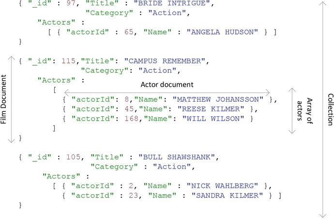
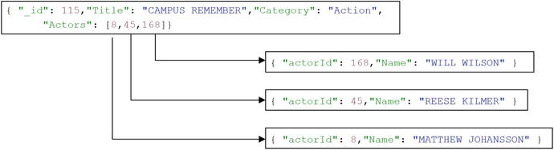
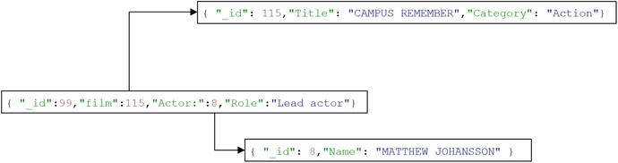

# Week 09

Document Databases

MongoDB

---

## What is a Document Database?

> a nonrelational database that stores data as structure documents

- Usually for XML or JSON
- Nothing more is specified
    - Could implement ACID if desired
        - But most do not
- Flourished after NoSQL breakout of 2008

----

## Reasons for Adoption

1. Addressed the conflict between Object-Oriented and Relational models
2. Self-describing formats enabled ad hoc queries not possible with key-value stores
3. Aligned well with web-based programming paradigms (e.g. AJAX)

---

# XML Databases

----

## XML

- The eXtensible Markup Language
- Capable of representing almost any form of data
- Helped separate content (HTML) and style (CSS)
- Gained enormous popularity in early 2000's as standard interchange format
    - All XML all the time

----

## XML Example

        <?xml version="1.0" encoding="UTF-8">
        <order date="2018-05-31" order_num="6a54dwd56">
            <cart>
                <item>
                    <label>La Croix 12-pack (Passionfruit)</label>
                    <price>$3.99</price>
                    <quantity>1</quantity>
                </item>
            </cart>
            <customer>
                <name>Some Dude</name>
                <acctID>fyw7e0f</acctID>
            <payment>
                <card_issuer>Visa</card_issuer>
                <card_number>123456789012345678</card_number>
                <confNum>fyw78fe7wd8</confNum>
            </payment>
        </order>

----

## XML Ecosystem

- XPath: syntax for navigating and filtering nodes on the XML tree
- XQuery: The SQL of XML
- XML Schema: A document that defines the structure of XML documents (written in XML)
- XSLT: programming language for transforming XML (written in XML)
- DOM: An OOP API for interacting with HTML documents

----

## Rise and Fall of XMLDBs

- Large volume of XML led to XML DBs
    - Most popular were MarkLogic and eXist
- But not marketed as alternatives to RDBMSs
    - Just a way to manage the glut of XML documents
- Many RDBMSs added XML functionality
- XML is still prevalent, but XML DBs have faded

---

# JSON Databases

----

## From XML to JSON

- XML is verbose
    - Wastes storage space
    - Computationally expensive to parse
- XML is good for structured files, but JSON proved better for simple data exchange
    - Ideal for web development
- Thus XML DBs used for content mgmt - JSON DBs to support web-based applications

----

## JSON & AJAX

- AJAX (Asynchronous Javascript And XML)
- Enables JS code to request data from a server and update the screen without reloading the entire page
    - Popularized by Google Maps and GMail
- Douglas Crockford created JSON as a lightweight alternative to XML in AJAX
    - Quickly became the preferred format

----

## JSON Example

```json
{
    "date":"2018-05-31",
    "order_num": "6a54dwd56",
    "cart": [
        {
            "label": "La Croix 12-pack (Passionfruit)",
            "price": "$3.99",
            "quantity": 1
        }
    ],
    "customer": {
        "name": "Some Dude",
        "acctID": "fyw7e0f"
    },
    "payment": {
        "card_issuer": "Visa",
        "card_number": "123456789012345678",
        "confNum": "fyw78fe7wd8"
    }
}
```
----

## JSON Databases

- No formal specification
- Document is the basic unit of storage
    - Made of key-value pairs
    - Values can be nested documents or arrays
    - Equivalent of a row in relational DB
- Collections (or buckets) are sets of documents with a similar structure or purpose
    - Equivalent of a relational table
- Possible to achieve 3NF, But very uncommon
    - Most documents have nested hierarchies that represent dependent relationships

----

## Document Embedding

Imagine a DB about movies and actors



----

## Pros & Cons of Embedding

- Pro: enables single operation reads
    - No costly joins!
- Con: redundant data leads to inconsistencies
    - What if the embedded data changes?
- Compromise is to use links (like foreign keys)
    - But this means making multiple calls to construct the merged data
- Tradeoff
    - RDBMS: modeling based on storage of the data
    - DocDB: modeling based on the expected queries

----

### Traditional



### 3rd Normal Form



----

## JSON DB History

- 2005: CouchDB, Damien Katz (Lotus Notes)
    - MapReduce, eventual consistency, data versioning
    - Had some success but could not scale out enough
- 2009: MongoDB, 10gen (former DoubleClick staff)
    - ["Web Scale"](https://www.youtube.com/watch?v=b2F-DItXtZs)
    - JavaScript-based query language
- 2011: CouchBase = Membase + CouchDB
    - Membase: persistent variation of Memcached
    - Has a SQL-like language N1QL
- RDBMS now have JSON support

----

## MongoDB

- MongoDB won the JSON DB battle
- Most widely used NoSQL DB out there
    - Developer friendly
- Not as scalable as HBase or Cassandra, but still big
    - In use by CERN!

----

## Conclusion

- JSON is the dominant data format
    - Simpler and more efficient than XML
- MongoDB is the dominant NoSQL database
    - Happy medium between:
        - Relational Model and Schemaless KV Stores
        - SQL and MapReduce
        - RDBMS sharding and Hadoop
- But some new applications cannot be modeled in relational or document-based schemas
    - Enter the graph database...next week

---

# EOL
